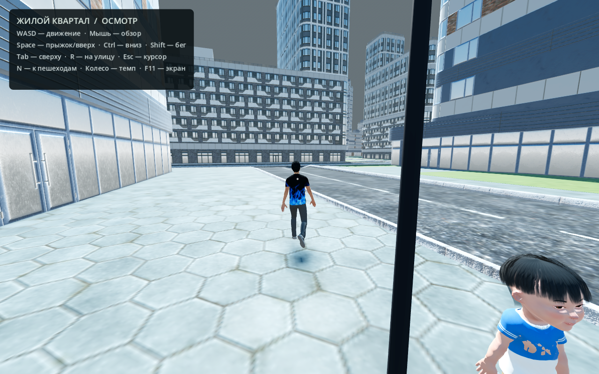

# Алматы — основа 3D-района

Готовая стартовая сцена для дальнейшей разработки игры в **Godot**: небольшой городской район, текстуры, объёмные здания с непроходимыми стенами и 24 самостоятельно гуляющих NPC. Модели доступны в **Blender (`.blend`)** и **glTF (`.glb`)**.

Карта основана на стороннем **Modern City Block**, дополненном жилыми домами по периметру. Это район для будущей адаптации под Алматы, а не точная реконструкция реального места. Интерьеров и автомобилей пока нет.



## Клонирование и запуск на другом ноутбуке

Репозиторий приватный: войдите в свой GitHub-аккаунт. Например, через GitHub CLI:

```sh
gh auth login
gh repo clone yrn-dev/kazakh-3d
cd kazakh-3d
```

При уже настроенном доступе к GitHub можно использовать обычный Git:

```sh
git clone https://github.com/yrn-dev/kazakh-3d.git
```

**Все модели находятся непосредственно в Git. Git LFS и повторное скачивание ассетов не требуются.** Кэш импорта Godot создаётся заново на каждом компьютере.

1. Установите **Godot 4.4.1** — проект проверен на этой версии, используется Compatibility renderer.
2. В Godot нажмите **Import**, выберите `godot/project.godot`.
3. Дождитесь первого импорта моделей и нажмите **F5**.

На Linux/macOS при наличии Godot в `PATH`:

```sh
./run
```

Если исполняемый файл лежит отдельно:

```sh
GODOT_BIN=/path/to/Godot ./run
```

На Windows можно открыть `run.bat`, если `godot.exe`/`godot4.exe` доступен в `PATH`. Либо указать полный путь через переменную `GODOT_BIN`. Запуск через редактор Godot не требует настройки `PATH`.

Отдельный просмотр четырёх персонажей с перенесённой ходьбой: `./run-walk` или `run-walk.bat`.

## Управление на карте

| Клавиши | Действие |
|---|---|
| WASD + мышь | Перемещение и обзор |
| Space / Ctrl | Прыжок/подняться вверх · опуститься вниз |
| Shift | Бег |
| N | Перейти к следующему пешеходу |
| R | Вернуться на начальную улицу |
| Tab | Общий вид района |
| Esc | Освободить/захватить курсор |
| Колесо мыши | Темп ходьбы (×0.5–×2.5) |
| F11 | Полный экран |

Камера — от первого лица: гравитация, прыжок, реалистичный темп (~4.8 м/с, бег ~8.4 м/с), покачивание при ходьбе и звуки шагов. NPC ходят по восьми замкнутым маршрутам по тротуарам и дворовым дорожкам, останавливаются перед наблюдателем. У каждого пешехода свой темп; иногда они замирают и оглядываются. Проезжая часть оставлена для будущих машин.

### Атмосфера и время суток

Суточный цикл занимает 8 минут реального времени (стартовая отметка — 10:00): солнце движется по небу, на закате небо теплеет, в сумерках загораются уличные фонари, ночью небо темнеет, появляются мерцающие звёзды, а освещает район «луна». Включены ACES-тонометрия, мягкие тени солнца, лёгкое свечение, туман для глубины и звёздное небо. Городской гул играет фоном постоянно, при ходьбе слышны шаги. Файлы звука генерируются скриптом без внешних зависимостей: `python3 scripts/generate_audio.py`.

## Где лежат модели

| Папка / файл | Содержимое |
|---|---|
| `blender/modern_city_enclosed.blend` | Актуальная карта с дополнительными домами и закрытым периметром |
| `blender/modern_city_block.blend` | Базовый подготовленный квартал |
| `blender/characters/*.blend` | Пять персонажей с исходными скелетами |
| `blender/characters/walking/*_walk.blend` | Четыре персонажа с перенесённой ходьбой, действие `Walk` |
| `godot/assets/modern_city_enclosed.glb` | Готовая карта для движка |
| `godot/assets/characters/*_walk.glb` | Все пять персонажей с ходьбой, включая Jane |
| `source/modern_city_block.glb` | Скачанный оригинал карты |
| `source/characters/*.glb` | Скачанные оригиналы персонажей |
| `godot/main.tscn` | Основная сцена |
| `godot/pedestrians.gd` | Движение, темп анимации, остановки и оглядки NPC |
| `godot/pedestrian_routes.json` | Пешеходные маршруты |
| `godot/day_night.gd` | Суточный цикл: солнце/луна, небо, туман, тонометрия |
| `godot/street_lights.gd` | Уличные фонари, зажигаются на закате |
| `godot/assets/audio/*.wav` | Городской гул и шаги (генерируемые) |
| `scripts/` | Подготовка карты, перенос ходьбы, генерация маршрутов и звука, проверки |

Blender-файлы сохранены в **Blender 5.2.2 LTS** с упакованными текстурами. Для редактирования предпочтительна та же или более новая совместимая версия. Для запуска Godot Blender не требуется.

Ходьба взята из Everyday Jane и перенесена на Teen Boy, Asian Boy, Cartoon Girl и Cartoon Man. Цикл занимает около 1.033 секунды. У экспортных копий анимация запечена в деформирующие кости; исходные риги сохранены отдельно. Лицевые shape keys и управляющие IK-контроллеры не перенесены в упрощённые игровые копии.

## Проверки и дальнейшая разработка

Проверить полноту скачанных моделей (требуется Python 3):

```sh
python3 scripts/verify_assets.py
```

Проверить сцену после изменения кода (закроется после проверки):

```sh
./run -- --npc-check
./run -- --smoke
```

Проверены 24 NPC, 513 точек опоры и прохода, 480 секунд моделируемого движения, управление камерой, 16 столкновений с фасадами и 15 сегментов периметра.

Для обычной разработки достаточно Godot. Для повторной генерации маршрутов из Blender используются `scripts/build_pedestrian_grid.py` и `scripts/build_pedestrian_routes.py`; зависимости второго скрипта перечислены в `scripts/requirements.txt`. Скрипты подготовки работают относительно корня репозитория. Не запускайте генераторы без необходимости: они перезаписывают производные рабочие файлы. Скрипт первого импорта персонажей специально отказывается заменять уже существующие исходные `.blend`.

## Авторы и лицензии

Ссылки на источники, авторов и условия находятся в [CREDITS.txt](CREDITS.txt). У персонажей указана CC BY 4.0 — сохраняйте авторство моделей и автора исходной анимации XRProfXR. Для Modern City Block действует указанная на исходной странице Free Standard License; приватная копия проекта не меняет условий использования сторонних ассетов.

Архивные сведения о раннем эксперименте с Blosm в `CREDITS.txt` сохранены для истории. Сам эксперимент и кэш Godot не включены в этот репозиторий. Единой новой лицензией сторонние модели не перелицензируются.
